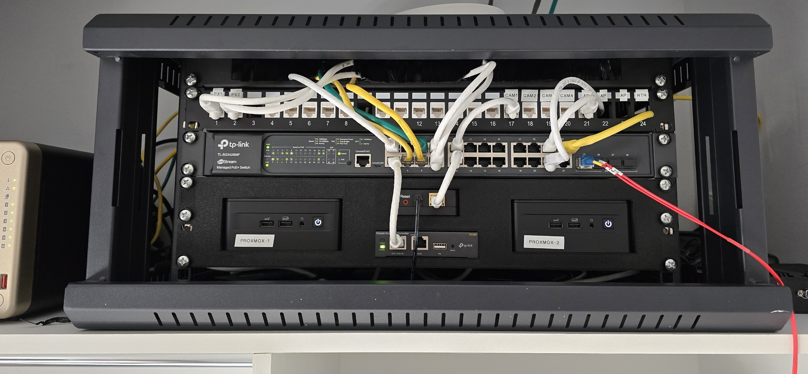

## Jimmy's Home Lab
All the self-hosted thangs, mostly controlled by Ansible.

### Ansible Automation with GitHub Copilot

I'm using GitHub Copilot as an AI-powered Ansible administrator to help automate the deployment and management of services across the homelab. The agent follows a detailed role creation guide that keeps things consistent - it always starts by researching official documentation and Docker Hub examples before creating anything, uses battle-tested configurations from LinuxServer.io where available, and automatically wires up DNS, reverse proxies, Homepage dashboard entries, and health checks for each service. The approach emphasizes idempotent deployments (so you can run playbooks repeatedly without breaking things) and proper network isolation for multi-container stacks. It's basically letting an LLM do the heavy lifting while keeping guardrails in place to ensure everything follows best practices.

The agent prompts are in [./github/agents](./github/agents).

**This is a work in progress - Not all deployed apps are via Ansible yet, not all roles are used by playbooks (or even tested) yet, and there's probably smarter ways of doing things. I'm always learning!**

This will deploy:
- Docker
- [Homepage](https://gethomepage.dev/)
- **Media Services:**
  - [Jellyfin](https://hub.docker.com/r/linuxserver/jellyfin)
  - [Plex](https://hub.docker.com/r/linuxserver/plex)
  - [Tautulli](https://tautulli.com/)
  - [Jellyseerr](https://hub.docker.com/r/fallenbagel/jellyseerr)
  - [Overseerr](https://hub.docker.com/r/linuxserver/overseerr) (not in master playbook)
- **Arr Suite Stack (media automation):**
  - [Sonarr](https://hub.docker.com/r/linuxserver/sonarr)
  - [Radarr](https://hub.docker.com/r/linuxserver/radarr)
  - [Prowlarr](https://hub.docker.com/r/linuxserver/prowlarr)
  - [Lidarr](https://hub.docker.com/r/linuxserver/lidarr)
  - [SABnzbd](https://hub.docker.com/r/linuxserver/sabnzbd)
  - [qBittorrent](https://hub.docker.com/r/linuxserver/qbittorrent)
  - [Huntarr](https://github.com/plexguide/huntarr)
- **Productivity:**
  - [Paperless-ngx](https://github.com/paperless-ngx/paperless-ngx)
  - [n8n](https://n8n.io/)
- **Grafana Stack (monitoring & logs):**
  - [Grafana](https://grafana.com/)
  - [Prometheus](https://prometheus.io/)
  - [Loki](https://grafana.com/oss/loki/)
- **Infrastructure:**
  - [SWAG](https://docs.linuxserver.io/general/swag/) - Internal and external reverse proxies
  - [Node Exporter](https://github.com/prometheus/node_exporter) - Deployed on all Ubuntu hosts

### Hardware
- pfSense router from AliExpress (Intel Celeron J4125 Mini PC with 4x 2.5gbe eth ports)
- 2x Intel NUC 12 Pros with Proxmox HA cluster
- TP-Link Omada Controller with a 24 port POE switch and a few APs
- QNAP TS-664 NAS and TR-004 add-on. 6x 8TB drives and 4x 4TB drives in RAID 5 storage pools.



### Software
Services are Docker Compose files, wherever possible. These are hosted on a combination of VMs and LXC containers on the Proxmox host, with a couple of containers that are heavier on storage I/O, or use the Coral TPU, running on the QNAP NAS.

- The default OS for both VMs and LXCs is Ubuntu Server 22.04.
- LXC Containers are built from https://community-scripts.github.io/ProxmoxVE/scripts?id=ubuntu, rather than the LXCs with packaged apps from that repo.
- Jellyfin and Plex LXC containers are priveleged, with [hardware acceleration enabled](https://github.com/community-scripts/ProxmoxVE/blob/main/misc/hw-acceleration.sh).
- VMs are built from my own cloud-init template.
- The Home Assistant VM is the official HA OS image, and is not managed by Ansible. Installed using this helpful script: https://community-scripts.github.io/ProxmoxVE/scripts?id=haos-vm


### Variables
- Main variables to be configured are in `group_vars/all/vars.yaml`.
- Each role has variables for the folder location and docker container version.
- Secrets are encrypted with `ansible-vault`. An example command is at the top of `group_vars/all/vars.yaml`.
- The Ansible Vault password file is kept in my home folder, but this can be saved anyway. The file contains only a randomly generated password string, no keys or further information are required.

Some playbook tasks, such as the proxy configuration, will use the first host entry from a given group to provide as the internal URL behind the proxy, so it's best to structure the inventory with the host you want receiving traffic as the first entry in the group.

### Proxy Structure
There are 2 linuxserver/SWAG containers - one to accept incoming connections from outside the network, and one for internal traffic. I use DNS01 verification against Cloudflare to obtain wildcard LetsEncrypt certificates for each domain.

Currently, there is only the one NGINX proxy host for all services. I may split that out to have a proxy for internal traffic on each docker host if it floods the network on that host, but will see how it goes with the current configuration.

### Running the deployment playbook

1. The playbook uses Dig to retrieve IPs used in the reverse proxies, so will need the `dnspython` package. `pipx inject ansible dnspython` (I run Ansible in a venv).
2. Create an `ansible-vault` password file.
3. Update `group_vars/all/vars.yaml` with environment details. Use ansible-vault to encrypt anything that should be private using the password file.
4. Review `roles/[role]/vars/main.yaml` and confirm the target folder is desired.
5. Run the playbook:

```
ansible-playbook master_playbook.yaml -i inventory.yaml --vault-password-file ~/ansible_key
```

### Monitoring & Metrics
- **Grafana Stack (docker-1):** Grafana, Prometheus, and Loki deployed together for monitoring and log aggregation
### Monitoring & Metrics
- **Grafana Stack:** Grafana, Prometheus, and Loki deployed together for monitoring and log aggregation
- **Node Exporter:** Deployed on all Ubuntu hosts (VMs and LXCs) for system metrics
- Prometheus scrapes metrics from all Node Exporter endpoints using FQDNs
- Loki aggregates logs from all services
- If new hosts are added, ensure Node Exporter is running and the FQDN is resolvable from the Prometheus container
- Change the structure of the playbooks. If I deploy an app, it should make changes on any hosts required for that app to work (proxy, DNS, collectd, etc). This probably means limiting role templates to the initial config for deployment and having playbooks drop in chunks of config to those existing files, instead.
- Split out the internal proxy to each host and have the container tags add the service automatically.
- Have the playbook reserve DHCP leases and add aliases to DNS when a new host is created. Currently, these are in pfSense, but I may switch to OPNsense before adding this functionality.

### Removed
- [Watchtower](https://github.com/containrrr/watchtower) (on each Docker host) -- removed