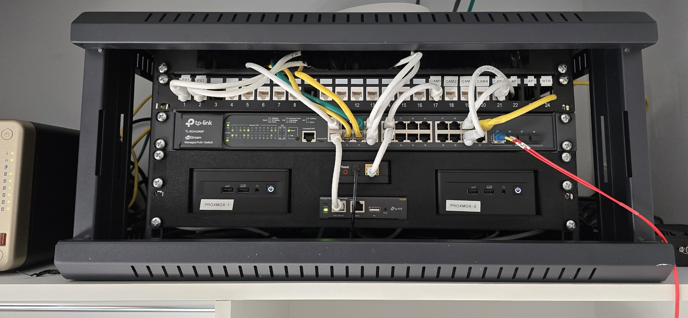

## Jimmy's Home Lab
All the self-hosted thangs, mostly controlled by Ansible.

**This is a work in progress - not all deployed apps are via Ansible yet, not all roles are tested, and there's probably smarter ways of doing things. Always learning!**

### GitHub Copilot Agents

I use GitHub Copilot with custom agents and reusable skills to manage the homelab.

**Agents** have domain-specific knowledge and tool access, defined in [.github/agents](.github/agents):

- **ansible_admin** — Deploys and manages services via Ansible. Follows a [role creation guide](ansible/docs/ANSIBLE_ROLE_CREATION_GUIDE.md) for consistency: researches official docs, uses LinuxServer.io images where available, and wires up reverse proxies, Homepage entries, and health checks automatically.
- **grafana_admin** — Queries dashboards, explores Prometheus/Loki metrics, checks alerts, and manages incidents via MCP.
- **home_assistant_admin** — Manages Home Assistant entities, automations, scenes, and dashboards via MCP.
- **proxmox_admin** — Manages VMs, LXC containers, and cluster resources via MCP.

**Skills** are step-by-step instructions in [.github/skills](.github/skills) that Copilot loads on demand when a task matches their domain. They encode repeatable patterns — like scaffolding an Ansible role, templating a Docker Compose file, or wiring up a SWAG proxy config — so each deployment follows the same conventions without re-explaining the process. Current skills cover: application research, role scaffolding, Docker deployment tasks, Compose templating, vault secrets, Homepage integration, NGINX/SWAG proxy configs, pfSense DNS management, UFW firewall rules, service health checks, and playbook creation/testing.

MCP server configuration is in [.github/copilot/mcp.json](.github/copilot/mcp.json).

### Deployed Services
- Docker
- [Homepage](https://gethomepage.dev/)
- **Media:**
  - [Jellyfin](https://hub.docker.com/r/linuxserver/jellyfin), [Plex](https://hub.docker.com/r/linuxserver/plex), [Tautulli](https://tautulli.com/)
  - [Jellyseerr](https://hub.docker.com/r/fallenbagel/jellyseerr), [Overseerr](https://hub.docker.com/r/linuxserver/overseerr)
- **Arr Suite (media automation):**
  - [Sonarr](https://hub.docker.com/r/linuxserver/sonarr), [Radarr](https://hub.docker.com/r/linuxserver/radarr), [Prowlarr](https://hub.docker.com/r/linuxserver/prowlarr), [Lidarr](https://hub.docker.com/r/linuxserver/lidarr)
  - [SABnzbd](https://hub.docker.com/r/linuxserver/sabnzbd), [qBittorrent](https://hub.docker.com/r/linuxserver/qbittorrent), [Huntarr](https://github.com/plexguide/huntarr)
- **Productivity:** [Paperless-ngx](https://github.com/paperless-ngx/paperless-ngx), [n8n](https://n8n.io/)
- **Monitoring:** [Grafana](https://grafana.com/), [Prometheus](https://prometheus.io/), [Loki](https://grafana.com/oss/loki/), [InfluxDB](https://www.influxdata.com/), [Alloy](https://grafana.com/oss/alloy/) (all hosts — collects logs via journald/Docker and metrics via built-in node exporter, pushed to Loki/Prometheus via remote write)
- **Infrastructure:** [SWAG](https://docs.linuxserver.io/general/swag/) (internal & external reverse proxies)

### Hardware
- pfSense router (Intel Celeron J4125 Mini PC, 4x 2.5gbe)
- 2x Intel NUC 12 Pro — Proxmox HA cluster
- TP-Link Omada (24-port POE switch + APs)
- QNAP TS-664 NAS + TR-004 (6x 8TB + 4x 4TB, RAID 5)



### Software
Services run as Docker Compose stacks on VMs and LXC containers across the Proxmox hosts, with a couple of storage-heavy or Coral TPU services on the QNAP NAS.

- Default OS: Ubuntu Server 22.04 for both VMs and LXCs.
- LXCs built from [community scripts](https://community-scripts.github.io/ProxmoxVE/scripts?id=ubuntu). Jellyfin and Plex are privileged with [hardware acceleration](https://github.com/community-scripts/ProxmoxVE/blob/main/misc/hw-acceleration.sh).
- VMs built from a cloud-init template.
- Home Assistant runs the [official HA OS image](https://community-scripts.github.io/ProxmoxVE/scripts?id=haos-vm), not managed by Ansible.

### Proxy Structure
Two linuxserver/SWAG containers — one for external traffic, one for internal. Both use DNS01 verification against Cloudflare for wildcard LetsEncrypt certificates. Currently a single NGINX proxy host serves all services.

### Variables & Secrets
- Main config: `group_vars/all/vars.yaml`. Per-role config: `roles/[role]/vars/main.yaml`.
- Secrets encrypted with `ansible-vault` (password file in home directory).
- Proxy tasks use the first host in each inventory group as the upstream target.

### Running the Playbook

1. Install `dnspython`: `pipx inject ansible dnspython`
2. Create an `ansible-vault` password file.
3. Configure variables in `group_vars/all/vars.yaml` (encrypt secrets with vault).
4. Run:
```
ansible-playbook master_playbook.yaml -i inventory.yaml --vault-password-file ~/ansible_key
```

### Monitoring
- Grafana, Prometheus, Loki, and InfluxDB are deployed together as a monitoring stack.
- Alloy runs on all Ubuntu hosts, shipping Docker container logs and system journal to Loki.
- Node Exporter runs on all Ubuntu hosts. Prometheus scrapes via FQDNs.
- cAdvisor outputs Docker metrics via Prometheus.
- InfluxDB receives metrics from Proxmox hosts and Home Assistant.
